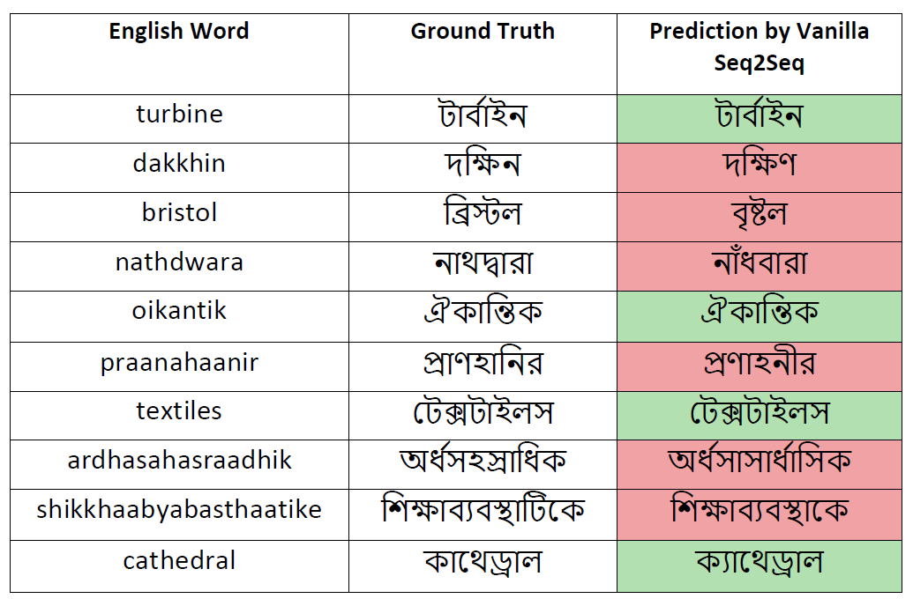
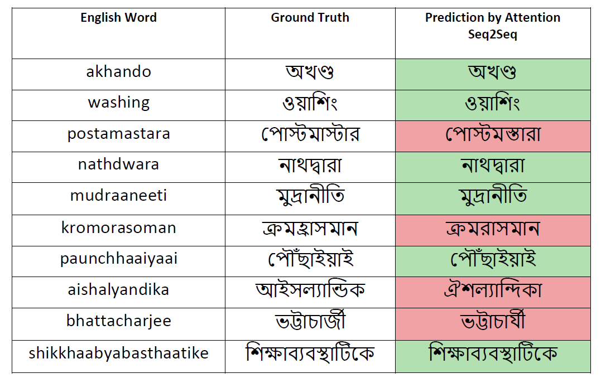
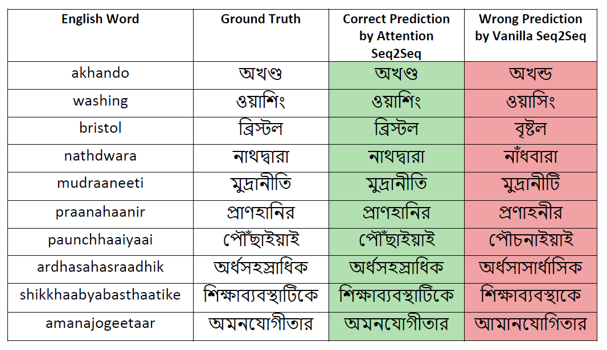

# CS6910 Assignment 3
Name: Oikantik Nath | Roll: CS22S013 | Course: CS6910 Fundamentals of Deep Learning | [WandB Report](https://wandb.ai/dl_research/CS6910_Assignment3/reports/Assignment-3-CS6910---Vmlldzo0MDc1MTA4?accessToken=3yu9rwpccb5yfgb8fqroo0egi0y73jktso9vx7fz9e7kcho6e8wshgvnu229jnd7)\
Task: Use recurrent neural networks to build a transliteration system.
#
## Question 1
To execute a single run (without attention) with desired hyperparameters on my seq2seq model, download the code [here](https://github.com/oikn2018/CS6910_assignment_3/blob/main/run_wo_att.py)

Next, execute the following on cmd/terminal:
```python
pip install torchtext==0.6.0
pip install wget
pip install gdown
pip install --upgrade gdown
```

#### File execution format with argparsing:

`python run_wo_att.py -load <load_model> -test <test_model> -lang <indic_lang> -do <dropout> -lr <learning_rate> -bs <batch_size> -iem <input_embedding_size> -nl <num_layers> -hs <hidden_size> -cell <cell_type> -bidir <bidirectional> -ep <epochs>`


For example:\
`python run_wo_att.py -load False -test True -lang ben -do 0.5 -lr 0.005 -bs 128 -iem 512 -nl 3 -hs 512 -cell GRU -bidir True -ep 15`


#### NOTE: 
Above example is not my best model, but just for illustration purpose. \
If you wish to run my code on my best model in Bengali language, execute:\
`python run_wo_att.py`


## Questions 2
Below is my sweep configuration for given transliteration task without attention mechanism.
```python
sweep_config = {
    'method': 'bayes', 
    'metric': {
      'name': 'val_accuracy',
      'goal': 'maximize'   
    },
    'parameters': {
        'dropout': {
            'values': [0.3, 0.5, 0.7]
        },
        'learning_rate': {
            'values': [0.001,0.005,0.0001,0.0005]
        },
        'batch_size': {
            'values': [64, 128, 256]
        },
        'input_embedding_size': {
            'values': [256, 512]
        },
        'num_layers': {
            'values': [1, 2, 3, 4]
        },
        'hidden_size':{
            'values': [256, 512, 1024]
        },
        'cell_type': {
            'values': ['RNN', 'LSTM', 'GRU']
        },
        'bidirectional': {
            'values': [True, False]
        },
        'epochs':{
            'values': [20, 25, 30]
        }
    }
}
```

Code to run sweeps without attention can be found at this [link](https://github.com/oikn2018/CS6910_assignment_3/blob/main/sweeps_wo_att.py)
To execute it, enter the following in cmd/terminal:
```python
pip install torchtext==0.6.0
pip install wandb
pip install wget
pip install gdown
pip install --upgrade gdown
python sweeps_wo_att.py
```

#### NOTE: 
* I used 'ben' dataset within Aksharantar as I am more comfortable with Bengali. However, I have added support for Hindi also so that I can verify my best model configuration with other languages to understand how it is doing with respect to other languages.

* I have added argparse support for individual code in later questions so that a particular run with desired hyperparameters can be run.


## Question 4

### Question 4(a)

My best model configuration (without attention) found from the above sweep is given below:
```python
        config = {
        	"dropout": 0.3,
        	"learning_rate": 0.0005,
        	"batch_size": 128,
        	"input_embedding_size": 256,
        	"num_layers": 4,
        	"hidden_size": 512,
        	"cell_type": 'GRU',
        	"bidirectional": False,
        	"epochs": 30
        }
```


To verify results/ execute a single run (without attention) with desired hyperparameters, download the code [here](https://github.com/oikn2018/CS6910_assignment_3/blob/main/run_wo_att.py)
Next, execute the following on cmd/terminal:
```python
pip install torchtext==0.6.0
pip install wget
pip install gdown
pip install --upgrade gdown
```

#### File execution format:
`python run_wo_att.py -load <load_model> -test <test_model> -lang <indic_lang> -do <dropout> -lr <learning_rate> -bs <batch_size> -iem <input_embedding_size> -nl <num_layers> -hs <hidden_size> -cell <cell_type> -bidir <bidirectional> -ep <epochs>`


For example,\
`python run_wo_att.py -load False -test True -lang ben -do 0.5 -lr 0.005 -bs 128 -iem 512 -nl 3 -hs 512 -cell GRU -bidir True -ep 15`


#### NOTE: 
Above example is not my best model, but just for illustration purpose. \
I have tested my best model on the Aksharantar Bengali as well as Hindi dataset to verify if my best model without attention gives good test accuracy scores on both.


> INDIC LANGUAGE: **BENGALI**\
Best Validation Accuracy: 41.78%\
Best Test Accuracy: 35.62%

To test my code on the Bengali dataset with my best model (without attention),execute the following on cmd/terminal:\
`python run_wo_att.py -lang ben -test True`


>INDIC LANGUAGE: **HINDI** \
Best Validation Accuracy: 41.32% \
Best Test Accuracy: 39.57%

To test my code on the Hindi dataset with my best model (without attention), execute the following on cmd/terminal: \
`python run_wo_att.py -lang hin -test True`


>**Observation:** \
My best model reports much higher test accuracy for Hindi dataset than Bengali dataset for both non-attention and attention models. This can suggest that the test data for Bengali is much more difficult than Hindi test data.

### Question 4(b)
`predictions_vanilla.csv` in `predictions_vanilla` directory in my GitHub repository can be found [here](https://github.com/oikn2018/CS6910_assignment_3/tree/main/predictions_vanilla)

#### NOTE: 
* `predictions_vanilla.csv` contains only predictions from Bengali Test Dataset 

Some sample inputs from this file are also given below: 

<p align="center">
	
</p>


## Question 5
### Question 5(b)

My best model configuration (for attention) found from the above sweep is given below:
```python
        config = {
          "dropout": 0.3,
          "learning_rate": 0.0005,
          "batch_size": 256,
          "input_embedding_size": 256,
          "num_layers": 2,
          "hidden_size": 1024,
          "cell_type": 'GRU',
          "bidirectional": True,
          "epochs": 30
        }
```

To verify results/execute a single run (with attention) with desired hyperparameters, download the code [here](https://github.com/oikn2018/CS6910_assignment_3/blob/main/run_w_att.py)
Next, execute the following on cmd/terminal:
```python
pip install torchtext==0.6.0
pip install wget
pip install gdown
pip install --upgrade gdown
```

#### File execution format:
`python run_w_att.py -load <load_model> -test <test_model> -lang <indic_lang> -do <dropout> -lr <learning_rate> -bs <batch_size> -iem <input_embedding_size> -nl <num_layers> -hs <hidden_size> -cell <cell_type> -bidir <bidirectional> -ep <epochs>`


For example, \
`python run_w_att.py -load False -test True -lang ben -do 0.5 -lr 0.005 -bs 128 -iem 512 -nl 3 -hs 512 -cell GRU -bidir True -ep 15`


#### NOTE: 
Above example is not my best model, but just for illustration purpose. \
I have tested my best model on the Aksharantar Bengali as well as Hindi dataset to verify if my best model without attention gives good test accuracy scores on both.


> INDIC LANGUAGE: **BENGALI** \
Best Validation Accuracy: 44.40% \
Best Test Accuracy: 38.23% 

To test my code on the Bengali dataset with my best model (without attention), execute the following on cmd/terminal: \
`python run_w_att.py -lang ben -test True`


> INDIC LANGUAGE: **HINDI** \
Best Validation Accuracy: 45.26% \
Best Test Accuracy: 42.93% 

To test my code on the Hindi dataset with my best model (without attention), execute the following on cmd/terminal: \
`python run_w_att.py -lang hin -test True`


>**Observation:** \
My best model configuration reports much higher test accuracy for Hindi dataset than Bengali dataset for both non-attention and attention models. This can suggest that the test data for Bengali is much more difficult than Hindi test data.


- Link to `predictions_attention.csv` in `predictions_attention` directory in my GitHub repository can be found [here](https://github.com/oikn2018/CS6910_assignment_3/tree/main/predictions_attention)

#### NOTE:
predictions_attention.csv contains only predictions from Bengali Test Dataset \
Some sample inputs from this file are also given below:
<p align="center">
	
</p>

### Question 5(c)
From the `predictions_attention.csv` and the `predictions_vanilla.csv` files listed above, I have run a script to note down all the outputs that were correctly predicted by my Attention Seq2Seq model but were incorrectly predicted by my Vanilla model. This file is available in the repository at this [link](https://github.com/oikn2018/CS6910_assignment_3/blob/main/compare_vanilla_vs_att.csv)
Some examples from this file are also given below:
<p align="center">
	
</p>

- Configuration 3: 
```python
config = { 
	"epochs" : 20,
	"learning_rate": 0.0001,
	"no_hidden_layers": 5, 
	"hidden_layers_size": 256,
	"weight_decay": 0,
	"optimizer": "adam",
	"batch_size": 128,
	"weight_initialization" : "xavier" ,
	"activations" : "relu",
}
```
To run above configuration, download [code](https://github.com/oikn2018/CS6910_assignment_1/blob/main/Q10.py) from GitHub and execute following command on cmd:
`python Q10.py -wp Testing -we dl_research -d mnist -e 20 -b 128 -o adam -lr 0.0001 -w_i Xavier -nhl 5 -sz 256 -a relu`

---
The codes are organized as follows:

| Question | Location | Function | 
|----------|----------|----------|
| Question 1 | [Question-1](https://github.com/oikn2018/CS6910_assignment_1/blob/main/Q1.ipynb) | Plotting Sample Images of Each Class | 
| Question 2-4 | [Question-2-4](https://github.com/oikn2018/CS6910_assignment_1/blob/main/train.py) | Feedforward Neural Network Training and Evaluating Accuracies |
| Question 7 | [Question-7](https://github.com/oikn2018/CS6910_assignment_1/blob/main/Q7.py) | Confusion Matrix for Test Data on Best Model | 
| Question 10 | [Question-10](https://github.com/oikn2018/CS6910_assignment_1/blob/main/Q10.py) | 3 Best Hyperparameter configurations for MNIST | 
